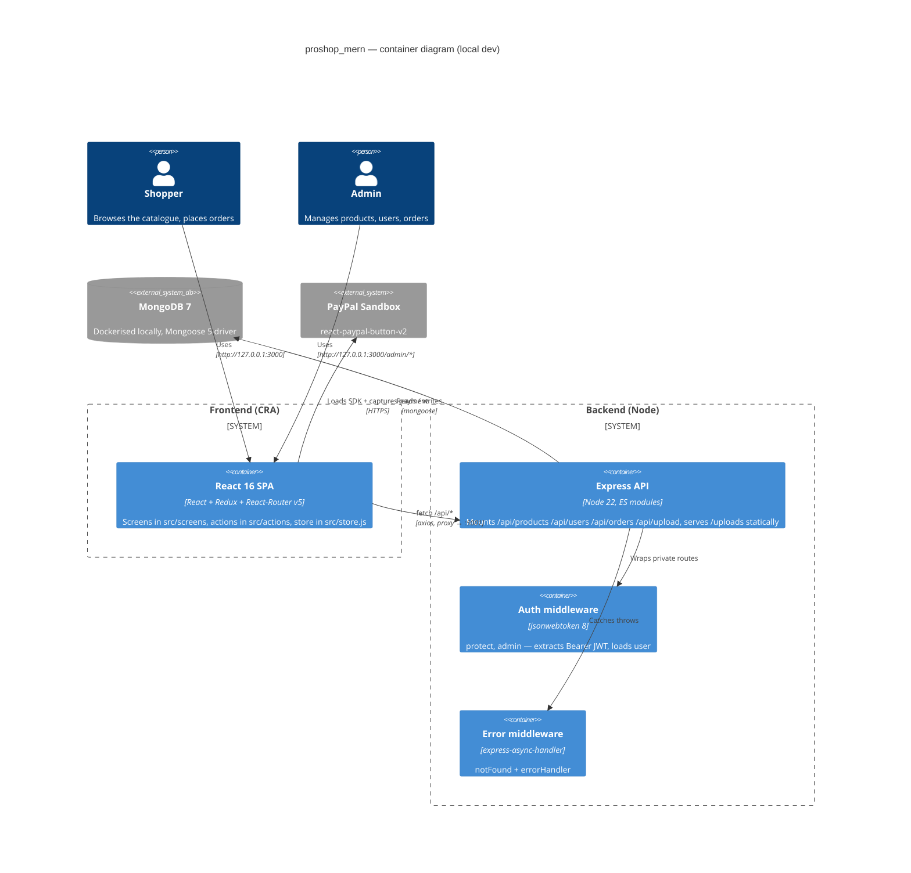
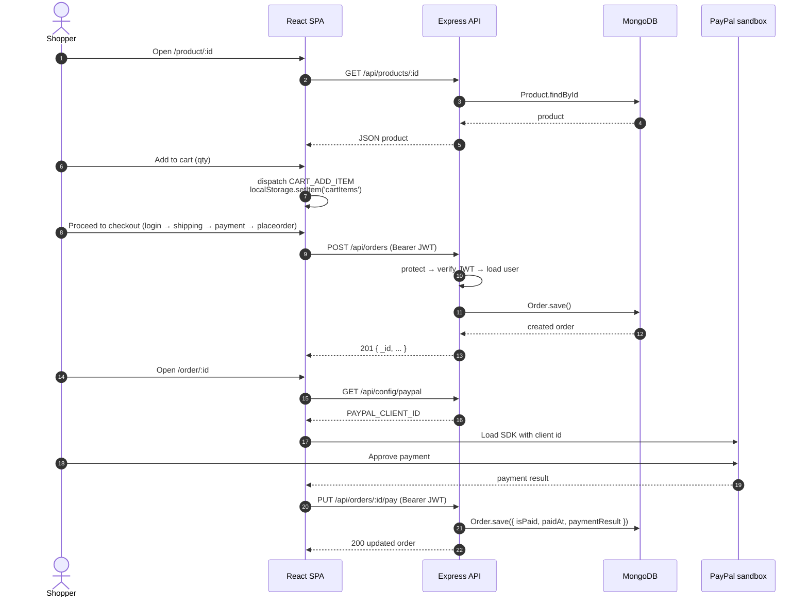
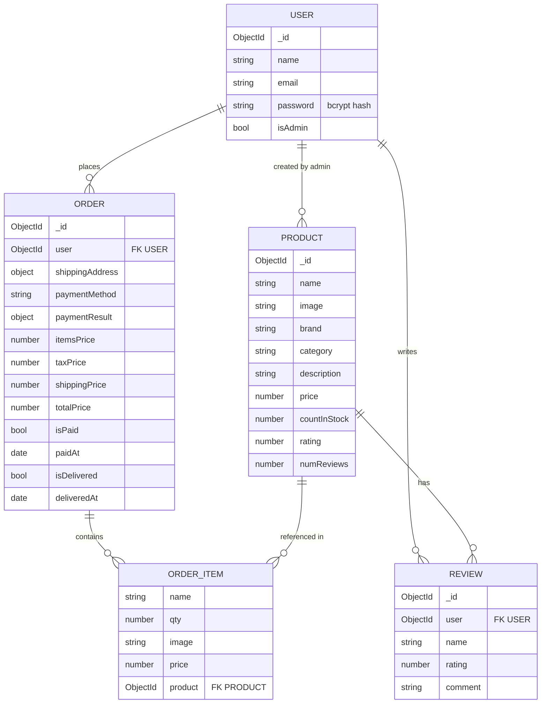

# Architecture — proshop_mern

GitHub renders the blocks below as diagrams. If you see raw code,
make sure you are viewing this file on github.com, not a raw mirror.

## C4 Container view

How the major runtime pieces talk at dev time.

## HTTP request flow — "add to cart → checkout → pay"

The happy-path sequence a shopper drives during checkout.

## Data model (informal)

A Mongoose-level ER sketch — enough to navigate controllers without opening every model file.

